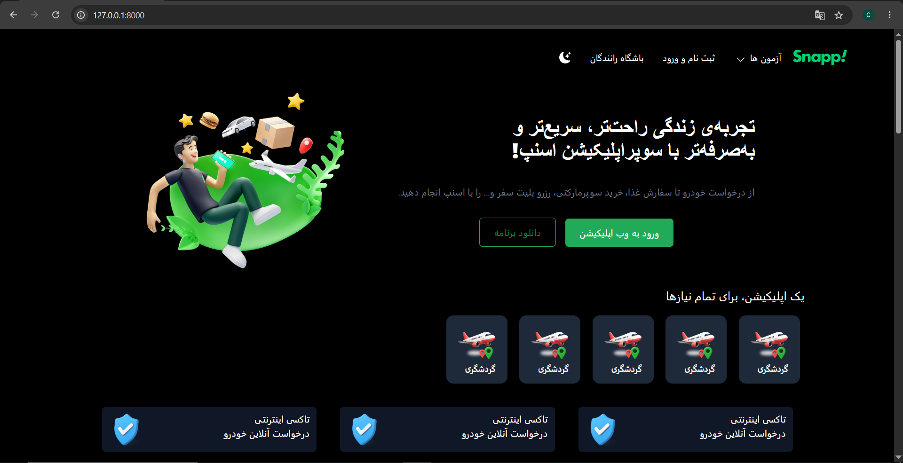
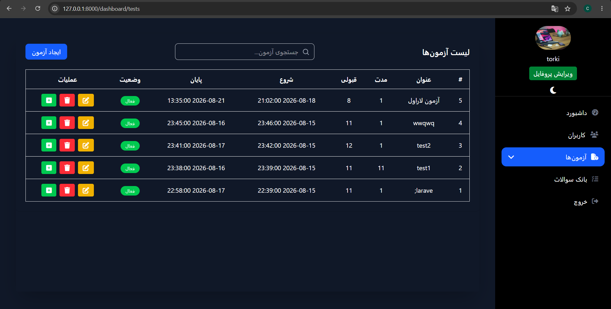
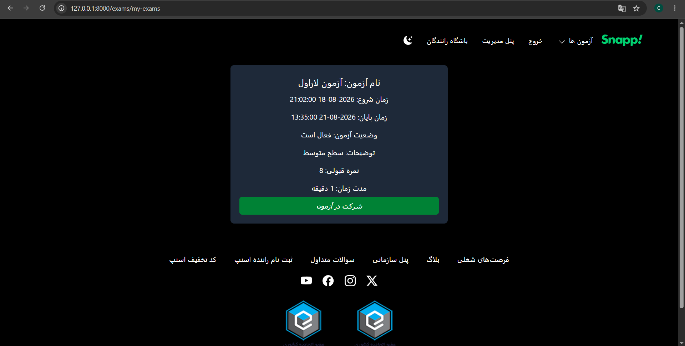

# 🎓 ExamHub

> A modern online examination platform built with Laravel and Livewire, focused on a smooth user experience, responsive UI, secure exam timing, automatic submission, and backend-based exam evaluation.

---

## 📸 Screenshots

### Homepage



### Exams Dashboard


### Users List



### Exam List



> Replace the image paths above with your actual screenshots.

---

## 🎥 Demo

[▶️ Watch the Demo](YOUR_DEMO_VIDEO_LINK)

The demo shows the main application flow, including browsing exams, registration, starting an exam, answering questions, timer handling, submission, and displaying the final result.

---

## ✨ Features

### 🎨 UI & User Experience

* Fully responsive design
* Mobile, tablet, and desktop support
* Dark mode
* Loading states
* Button click animations
* Interactive navigation menus
* Responsive slider
* Manual slider controls
* Auto-play slider
* Touch / swipe support
* Smooth interactions without unnecessary page refreshes

### 👤 Authentication

* User registration
* User login
* Secure logout
* Session management
* Authentication-based access control

### 📝 Exam System

* Browse all available exams
* Register for an exam
* "My Exams" section
* Start an exam
* Display questions and options
* Navigate between questions
* Store submitted answers
* Exam countdown timer
* Manual exam submission
* Automatic submission when the exam time expires

### ⏱️ Secure Exam Timing

The exam timer is not trusted as the source of truth.

The client-side timer is mainly responsible for displaying the remaining time, while Laravel validates the actual exam timing on the backend.

If a user:

* Manipulates the client-side timer
* Refreshes the page
* Closes the browser
* Reopens the browser
* Leaves an exam unfinished

the backend can still determine whether the exam has expired.

Started but unsubmitted exams are checked using the **Laravel Scheduler** and can be automatically submitted and evaluated after their allowed time has expired.

### ✅ Automatic Exam Evaluation

After submission, the system:

1. Retrieves the exam questions.
2. Checks the user's selected answers.
3. Compares each answer with the correct option.
4. Calculates the number of correct answers.
5. Calculates the final score.
6. Stores the score in the database.

The final score is calculated on a 20-point scale:

```text
Score = (Correct Answers / Total Questions) × 20
```

### 🗄️ Database & Eloquent

* Eloquent ORM
* Model relationships
* Many-to-Many relationships
* Pivot tables
* Foreign keys
* Cascade deletes
* Database migrations
* Duplicate registration prevention
* Score storage

---

## 🛠️ Technologies

### Backend

* PHP
* Laravel
* Laravel Livewire
* Eloquent ORM
* Laravel Scheduler
* Blade

### Frontend

* HTML5
* CSS3
* Tailwind CSS
* JavaScript

### Database

* MySQL

### Development Tools

* Git
* GitHub
* Composer
* NPM
* Vite

---

## 🏗️ Application Flow

```text
User
 │
 ├── Register / Login
 │
 └── Browse Exams
        │
        ├── Register for Exam
        │
        └── Start Exam
               │
               ├── Questions
               ├── Options
               ├── Answers
               ├── Countdown Timer
               │
               └── Submit
                      │
                      ├── Evaluate Answers
                      ├── Calculate Score
                      └── Store Result
```

Expired and unfinished exams are also checked by the Laravel Scheduler.

---

## 🔐 Backend Validation

Important exam-related logic is handled on the backend instead of relying only on JavaScript.

The server validates the exam state and timing before accepting the final submission.

This prevents users from bypassing the exam time simply by manipulating the client-side timer.

---

## ⚡ Livewire

Livewire is used for interactive parts of the application, including:

* Dynamic UI interactions
* Modals
* Exam interactions
* Question navigation
* Events
* State management
* Submission handling

The application can provide SPA-like interactions while keeping the Laravel backend and Livewire architecture.

---

## 📁 Project Structure

```text
app/
├── Http/
├── Livewire/
├── Models/
└── ...

database/
└── migrations/

resources/
├── views/
└── ...

routes/
└── web.php
```

---

## 🚀 Installation

Clone the repository:

```bash
git clone YOUR_REPOSITORY_URL
cd ExamHub
```

Install PHP dependencies:

```bash
composer install
```

Create the environment file:

```bash
cp .env.example .env
```

Generate the application key:

```bash
php artisan key:generate
```

Configure your database in `.env`.

Run migrations:

```bash
php artisan migrate
```

Install frontend dependencies:

```bash
npm install
```

Build frontend assets:

```bash
npm run build
```

Start the Laravel development server:

```bash
php artisan serve
```

---

## ⏰ Scheduler

Exam expiration is handled using Laravel Scheduler.

For production environments, configure a system Cron job to execute the Laravel scheduler regularly.

---

## 📌 Project Status

**Completed ✅**

ExamHub was built as a real-world Laravel project to practice and implement the complete lifecycle of an online examination system — from authentication and exam registration to timed exam sessions, answer submission, automatic evaluation, and score calculation.

---

## 🎯 Project Goals

The main goal of ExamHub was not only to build a functional application, but also to improve practical skills in:

* Laravel development
* Livewire
* Eloquent relationships
* Database design
* Backend validation
* Exam logic
* JavaScript interactions
* Responsive UI development
* Tailwind CSS
* Scheduler and automated backend tasks
* Building a complete web application

---

## 👨‍💻 Developer

**Mohammad Torki**

PHP / Laravel Backend Developer
Frontend & UI Enthusiast

* GitHub: **https://github.com/MOHAMAD138755**
* Repository: **https://github.com/MOHAMAD138755/ExamHub**
